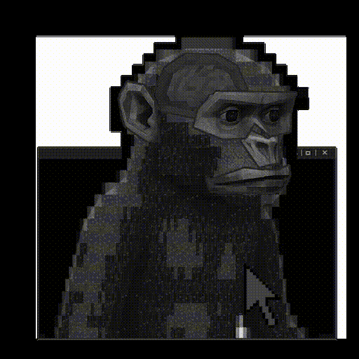

<!-- Header Text (No Banner - Closer Spacing) -->
<h1 align="center" style="margin-bottom: 5px;">
  Hi , I am Befikir.
</h1>

  
  

    
  

---

## 🛠️ **Tech Stack & Preview**

  

    

      <table>
        <tr>
          <td align="center" width="80"> JavaScript</td>
          <td align="center" width="80"> Python</td>
          <td align="center" width="80"> React</td>
          <td align="center" width="80"> Node.js</td>
          <td align="center" width="80"> Three.js</td>
        </tr>
        <tr>
          <td align="center" width="80"> Firebase</td>
          <td align="center" width="80"> TypeScript</td>
          <td align="center" width="80"> C++</td>
          <td align="center" width="80"> Bash</td>
          <td align="center" width="80"> Linux</td>
        </tr>
      </table>
    

    

      
    

  

---

## 🚀 **Featured Projects**

  <table>
    <tr>
      <td>
        <h3>📚 Archive</h3>
        
Community-powered library of books and past exams

        
        
          
        
      </td>
      <td>
        <h3>🏫 AASTU-SOCIAL</h3>
        
In-campus social media platform

        
        
          
        
      </td>
    </tr>
    <tr>
      <td>
        <h3>📡 WIFI-Crasher</h3>
        
WiFi security testing suite (Python)

        
        
          
        
      </td>
      <td>
        <h3>🪐 3D Portfolio</h3>
        
Interactive portfolio with Three.js

        
        
          
        
      </td>
    </tr>
  </table>

---

## 🎓 **Education**

| **Addis Ababa Science and Technology University** |
|:-------------------------------------------------:|
| **B.Sc. Software Engineering** |
| 📅 2024 - 2028 (Expected) |

---

## 📫 **Connect With Me**

 
  
  

---

<!-- Footer -->

  
  
<b>Thanks for visiting! 😊</b>

