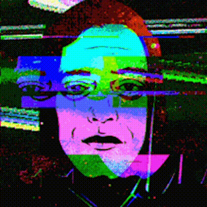
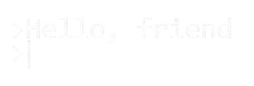

# root@befikir:~$ whoami

  
  
  

---

## > boot_sequence.log

<pre style="margin:0 auto;width:100%;max-width:920px;box-sizing:border-box;white-space:pre-wrap;word-break:break-word;overflow-wrap:anywhere;font-size:13px;line-height:1.35;"><code>$ sudo nmap -sV creativity

PORT     STATE SERVICE   VERSION
22/tcp   open  ssh       discipline
80/tcp   open  http      full-stack-engineering
443/tcp  open  https     secure-by-default
3000/tcp open  devserver shipping-side-projects

OS: Linux-first mindset
Status: Building useful things at weird hours.

[sys] loading dotfiles...
[sys] mounting /dev/creativity
[ok ] ssh tunnel stable
[ok ] stack compiler warmed
[ok ] deploy agent armed
[log] focus mode: deep work
[log] soundtrack: Fur Elise
[end] boot sequence complete.</code></pre>

  
  

---

## > stack.tree

  

---

## > telemetry.dashboard

  
  

  

<b>GitHub Timeline:</b> Feb 26, 2024 - Present

  

---

## > projects.index

<h3>Archive</h3>

Community-powered library of books and past exams.

  

<h3>AASTU-SOCIAL</h3>

Campus social platform focused on connection and speed.

  

<h3>WIFI-Crasher</h3>

Ethical WiFi security testing toolkit in Python.

  

<h3>3D Portfolio</h3>

Immersive web portfolio powered by Three.js and motion.

  

---

## > contribution.snake

  

---

## > connect --secure

  
  

  

